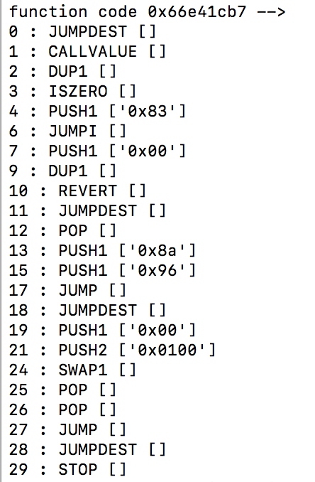
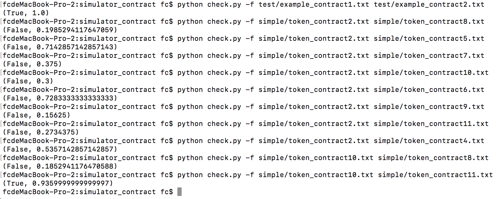
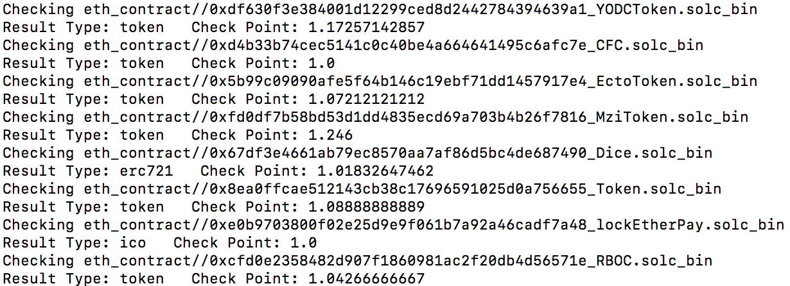

## 引言

在二进制代码识别的过程中,我们常用的方法是特征码识别和相似性检验来判断目标代码是否属于某个类别的代码(比如说识别正常代码还是恶意代码).本文我们来介绍Simhash 的计算与检验原理,与如何应用到对区块链的合约进行识别分类.

## Simhash 的原理

我们常见的哈希算法:MD5 ,Sha-256 ,keccak 等算法是把一段文字文本单向序列化为一串十六进制的字符串.在密码学里面,我们可以理解文本处理算法是单向或者双向的,单向的意思是文本经过特定的处理之后不能够恢复成为原文;双向的意思是文本经过算法的处理可以由特定的规则或者密钥把处理过的文本恢复成原文.上面提到的哈希算法还存在一个特性就是*雪崩效应*,意思是原本任意修改了某一处字符,都会导致哈希之后的结果“完全不相同”,举个例子:

```python
>>> import hashlib
>>> md5 = hashlib.md5()
>>> md5.update('mnhjkiuy6789')
>>> md5.hexdigest()
'2f75db558233d9a37f96820887ec4d00'

>>> md5 = hashlib.md5()
>>> md5.update('mnhjkiUy6789')
>>> md5.hexdigest()
'f2feb3213f33cba03907cfda315e47fd'
```

Simhash 则是和MD5 ,Sha-256 等算法反过来,它不考虑雪崩效应对结果的影响,我们修改文本其中一些地方,计算出来的结果哈希值有改变,存在部分相同,举个例子:

```python
>>> from simhash import Simhash
>>> hex(Simhash('mnhjkiuy6789').value)
'0x5d680d86c2b80b89'

>>> hex(Simhash('mnhjkioy6789').value)
'0x5b4899a643b90fb1'

>>> hex(Simhash('mnhjkiuy679').value)
'0x58400c8280b84181'
```

那么要计算两个文本之间是否相似,我们可以使用distance() 函数来计算相似结果.

```python
>>> Simhash('mnhjkiuy6789').distance(Simhash('mnhjkioy6789'))
14
```

## 智能合约代码结构分析

智能合约的代码从整体上可以分为两部分:入口处理代码和函数执行代码;从函数上可以分为四部分:预检测代码,参数处理代码,返回值处理代码和主函数代码.下面用一段简单的示例代码来分析:

```solidity
pragma solidity 0.4.25;

contract test {
    
    function a() {
        uint d = 123;
    }
    
    function b() {
        uint c = block.number;
    }
    
}
```

对应的EVM 汇编:

```assembly
; ---- 合约Constructor 函数代码 ---
000 PUSH1 80
002 PUSH1 40
004 MSTORE
005 CALLVALUE
006 DUP1
007 ISZERO
008 PUSH2 0010
011 JUMPI
012 PUSH1 00
014 DUP1
015 REVERT
016 JUMPDEST
017 POP
018 PUSH1 df
020 DUP1
021 PUSH2 001f
024 PUSH1 00
026 CODECOPY
027 PUSH1 00
029 RETURN
030 STOP
; ---- 合约执行代码 ----
; ---- 合约代码第一部分:从CALLDATALOAD 中获取用户要调用的函数地址并跳转 ----
031 PUSH1 80
033 PUSH1 40
035 MSTORE
036 PUSH1 04
038 CALLDATASIZE
039 LT
040 PUSH1 49
042 JUMPI
043 PUSH1 00
045 CALLDATALOAD  ;  从CALLDATALOAD 中获取函数hash 值
046 PUSH29 0100000000000000000000000000000000000000000000000000000000
076 SWAP1
077 DIV
078 PUSH4 ffffffff
083 AND
084 DUP1
; ---- 把从CALLDATALOAD 中获取的函数哈希来进行比对并跳转 ----
085 PUSH4 0dbe671f
090 EQ
091 PUSH1 4e
093 JUMPI
094 DUP1
; ---- 等价于代码 if (CALLDATALOAD[ : 4] == '0dbe671f') JUMP 0x4E;
095 PUSH4 cd580ff3
100 EQ
101 PUSH1 62
103 JUMPI
; ---- 等价于代码 if (CALLDATALOAD[ : 4] == 'cd580ff3') JUMP 0x62;
104 JUMPDEST
105 PUSH1 00
107 DUP1
108 REVERT  ; 执行合约异常退出并回滚数据
; ---- 等价于代码 else revert();
; ---- 合约中各函数的实现代码 ----
; ---- 函数"0dbe671f" 入口点代码
109 JUMPDEST
110 CALLVALUE
111 DUP1
112 ISZERO
113 PUSH1 59
115 JUMPI
116 PUSH1 00
118 DUP1
119 REVERT
; ---- 函数预检测代码,意思是对payable 进行检测,如果该函数不支持接收ETH Value ,那就退出执行
120 JUMPDEST
121 POP
122 PUSH1 60
124 PUSH1 a0
126 JUMP
; ---- 函数参数获取代码,因为这里没有参数,所以可以看到PUSH + (PUSH + JUMP) 的代码.
; ---- PUSH + JUMP 指的是跳转到0x76 这个位置(等价于JUMP 0x76),这个位置是函数的主入口点
; ---- PUSH1 60 指向的是返回值处理的代码,在执行完成函数代码之后就会跳转到这里
127 JUMPDEST
128 STOP
; ---- 函数返回值处理代码
129 JUMPDEST
130 CALLVALUE
131 DUP1
132 ISZERO
133 PUSH1 6d
135 JUMPI
136 PUSH1 00
138 DUP1
139 REVERT
; ---- 函数"cd580ff3" 的预处理代码
140 JUMPDEST
141 POP
142 PUSH1 8a
144 PUSH1 04
146 DUP1
147 CALLDATASIZE
148 SUB
149 DUP2
150 ADD
151 SWAP1
152 DUP1
153 DUP1
154 CALLDATALOAD
155 SWAP1
156 PUSH1 20
158 ADD
159 SWAP1
160 SWAP3
161 SWAP2
162 SWAP1
163 POP
164 POP
165 POP
166 PUSH1 a9
168 JUMP
; ---- 函数"cd580ff3" 的参数获取代码
169 JUMPDEST
170 PUSH1 40
172 MLOAD
173 DUP1
174 DUP3
175 DUP2
176 MSTORE
177 PUSH1 20
179 ADD
180 SWAP2
181 POP
182 POP
183 PUSH1 40
185 MLOAD
186 DUP1
187 SWAP2
188 SUB
189 SWAP1
190 RETURN
; ---- 函数"cd580ff3" 的返回值处理代码
191 JUMPDEST
192 PUSH1 00
194 PUSH1 7b
196 SWAP1
197 POP
198 POP
199 JUMP
; ---- 函数"0dbe671f" 的主体代码
200 JUMPDEST
201 PUSH1 00
203 DUP2
204 SWAP1
205 POP
206 SWAP2
207 SWAP1
208 POP
209 JUMP
; ---- 函数"cd580ff3" 的主体代码
210 STOP
; ---- 代码结束
211 LOG1
212 PUSH6 627a7a723058
219 SHA3
220 INVALID
221 INVALID
222 DUP8
223 PUSH19 42af5e74d82539058271e2d642452ff9c64837
243 INVALID
244 PUSH26 597224469f99f60029
; ---- 这些是CBOR 元数据,不是合约的代码
```

至此,我们已经了解到几点:

1. 编译好的solidity 汇编中包含了Constructor 代码和合约执行的代码,Constructor 代码是合约部署的时候由EVM 执行的初始化代码.初始化完成之后,后续要调用合约里的函数代码都在合约执行代码里面

2. 合约执行代码里面整体分为两部分,函数派发处理代码和函数代码
3. 对于函数代码来说分为四部分:预检测代码,参数处理代码,返回值处理代码和函数主体代码

理解这些细节之后,接下来就是尝试从合约的EVM 汇编中抽离函数代码出来.

## 定位合约执行代码

分析合约代码的第一步首先是定位到合约执行代码的部分.一般来说,这部分的代码都是先判断CALLDATASIZE 是否小于4 .根据这一点,提炼出来两种字节码识别方式.

```assembly
PUSH1
PUSH1
MSTORE
PUSH1
CALLDATASIZE
----
PUSH1
PUSH1
MSTORE
CALLDATASIZE
```

示例合约汇编代码:

```asm
; ---- 合约执行代码 ----
; ---- 合约代码第一部分:从CALLDATALOAD 中获取用户要调用的函数地址并跳转 ----
031 PUSH1 80
033 PUSH1 40
035 MSTORE
036 PUSH1 04
038 CALLDATASIZE
039 LT
```

组合成的搜索代码如下:

```python
def get_contract_runtime_entry(disassmbly_data) :
	disassmbly_address_list = disassmbly_data.get_disassmbly_address_list()
	disassmbly_address_list_length = disassmbly_data.get_disassmbly_address_list_length()

	for index in range(disassmbly_address_list_length) :
		if  'PUSH1' == disassmbly_data.get_disassmbly_by_address_index(index).get_opcode() and \
			'PUSH1' == disassmbly_data.get_disassmbly_by_address_index(index + 1).get_opcode() and \
			'MSTORE' == disassmbly_data.get_disassmbly_by_address_index(index + 2).get_opcode() and \
			'PUSH1' == disassmbly_data.get_disassmbly_by_address_index(index + 3).get_opcode() and '0x04' == disassmbly_data.get_disassmbly_by_address_index(index + 3).get_opcode_data(0) and \
			'CALLDATASIZE' == disassmbly_data.get_disassmbly_by_address_index(index + 4).get_opcode() :
			return disassmbly_address_list[index]
		elif 'PUSH1' == disassmbly_data.get_disassmbly_by_address_index(index).get_opcode() and \
			'PUSH1' == disassmbly_data.get_disassmbly_by_address_index(index + 1).get_opcode() and \
			'MSTORE' == disassmbly_data.get_disassmbly_by_address_index(index + 2).get_opcode() and \
			'CALLDATASIZE' == disassmbly_data.get_disassmbly_by_address_index(index + 3).get_opcode() :
			return disassmbly_address_list[index]

	return -1

```

## 分析函数入口点

从上面分析的合约汇编可以知道,PUSH4 + EQ + PUSH1 + JUMPI 是根据函数哈希来进行跳转的代码,我们在合约执行代码获取CALLDATALOAD 之后开始遍历汇编,直至到JUMPDEST + REVERT 指令.

示例合约汇编代码:

```assembly
043 PUSH1 00
045 CALLDATALOAD  ;  从CALLDATALOAD 中获取函数hash 值
046 PUSH29 0100000000000000000000000000000000000000000000000000000000
076 SWAP1
077 DIV
078 PUSH4 ffffffff
083 AND
084 DUP1
; ---- 把从CALLDATALOAD 中获取的函数哈希来进行比对并跳转 ----
085 PUSH4 0dbe671f
090 EQ
091 PUSH1 4e
093 JUMPI
094 DUP1
; ---- 等价于代码 if (CALLDATALOAD[ : 4] == '0dbe671f') JUMP 0x4E;
095 PUSH4 cd580ff3
100 EQ
101 PUSH1 62
103 JUMPI
; ---- 等价于代码 if (CALLDATALOAD[ : 4] == 'cd580ff3') JUMP 0x62;
104 JUMPDEST
105 PUSH1 00
107 DUP1
108 REVERT  ; 执行合约异常退出并回滚数据
```

实现代码:

```python
def get_function_entry(disassmbly_data) :
	function_entry_flag = ['PUSH1','CALLDATALOAD']  #  获取CALLDATA 的特征字节码
	disassmbly_address_list = disassmbly_data.get_disassmbly_address_list()
	disassmbly_address_list_length = disassmbly_data.get_disassmbly_address_list_length()
	entry_offset = 0

	for index in range(disassmbly_address_list_length) :
		if index + 2 > disassmbly_address_list_length :
			break

		current_address = disassmbly_address_list[index]
		next_address = disassmbly_address_list[index + 1]

		if  function_entry_flag[0] == disassmbly_data.get_disassmbly_by_address(current_address).get_opcode() and \
			function_entry_flag[1] == disassmbly_data.get_disassmbly_by_address(next_address).get_opcode() :
			entry_offset = index + 4

			break

	if not entry_offset :
		return False

	function_entry = function_entry_object({})
	current_function_hash = 0

	for index in range(entry_offset,disassmbly_address_list_length) :
		current_address = disassmbly_address_list[index]
		current_opcode = disassmbly_data.get_disassmbly_by_address(current_address)

		if 'JUMPDEST' == current_opcode.get_opcode() :
	 		break

	 	if 'PUSH4' == current_opcode.get_opcode() and not '0xffffffff' == current_opcode.get_opcode_data(0) :
	 		current_function_hash = current_opcode.get_opcode_data(0)
	 	elif 'PUSH1' == current_opcode.get_opcode() or 'PUSH2' == current_opcode.get_opcode() :
	 		if current_function_hash :
		 		function_entry.add_function_entry_address(current_function_hash,int(current_opcode.get_opcode_data(0),16))

	 		current_function_hash = 0

	return function_entry
```

## 抽离函数代码

从`get_function_entry()`中获取到各函数对应的入口点地址,那么第一步就需要判断这个地址是否是正确的位置,在EVM 里面规定了JUMP 或者JUMPI 指令跳转的目标指令必须是JUMPDEST 指令,所以第一步就需要去校验入口地址是否为正确.

示例合约汇编代码:

```assembly
; ---- 函数"0dbe671f" 入口点代码
109 JUMPDEST
110 CALLVALUE
111 DUP1
112 ISZERO
113 PUSH1 59
115 JUMPI
116 PUSH1 00
118 DUP1
119 REVERT
```

解析预检测部分的代码:

```python
function_entry_flag = disassmbly_data.get_disassmbly_by_address(function_entry_address).get_opcode()

if not 'JUMPDEST' == function_entry_flag :
	return False

#  1. analayis function pre-check 

if 'CALLVALUE' == disassmbly_data.get_disassmbly_by_address(function_entry_address + 1).get_opcode() :
	disassmbly_address_list_offset = disassmbly_address_list.index(function_entry_address + 2)
	function_pre_check_end_offset = 0
	function_argument_check_offset = 0

	for index in range(disassmbly_address_list_offset,disassmbly_address_list_length) :
		current_address = disassmbly_address_list[index]

		if index + 1 == disassmbly_address_list_length :
			break

		next_address = disassmbly_address_list[index + 1]
		#  从PUSH + JUMPI 中得到函数参数获取的跳转地址
		if ('PUSH1' == disassmbly_data.get_disassmbly_by_address(current_address).get_opcode() or 'PUSH2' == disassmbly_data.get_disassmbly_by_address(current_address).get_opcode()) and \
			'JUMPI' == disassmbly_data.get_disassmbly_by_address(next_address).get_opcode() :
			function_argument_check_offset = int(disassmbly_data.get_disassmbly_by_address(current_address).get_opcode_data(0),16)
		#  遇到JUMPDEST 指令,也就是指预检测代码到此已经结束了
		if 'JUMPDEST' == disassmbly_data.get_disassmbly_by_address(next_address).get_opcode() :
			function_pre_check_end_offset = current_address

			break
	#  从汇编代码中分割代码块
	function_pre_check_code = disassmbly_data.split_bytecode(function_entry_address,function_pre_check_end_offset)
	#  如果入口点指向的指令不是JUMPDEST ,那就是说跳转地址获取错误
	if not 'JUMPDEST' == disassmbly_data.get_disassmbly_by_address(function_argument_check_offset).get_opcode() :
		return False

	function_code_object.append_bytecode(function_pre_check_code)
else :  #  这不是预检测代码,那把它当作函数参数获取代码来解析
	function_argument_check_offset = function_entry_address
```

从预检测代码中得到函数参数获取代码之后,接下来从这部分代码中获取函数返回值处理代码和主函数代码.

示例合约汇编代码:

```assembly
; 无参数处理的例子
120 JUMPDEST
121 POP
122 PUSH1 60
124 PUSH1 a0
126 JUMP
; ---- 函数参数获取代码,因为这里没有参数,所以可以看到PUSH + (PUSH + JUMP) 的代码.
; ---- PUSH + JUMP 指的是跳转到0x76 这个位置(等价于JUMP 0x76),这个位置是函数的主入口点
; ---- PUSH1 60 指向的是返回值处理的代码,在执行完成函数代码之后就会跳转到这里

; 有一个uint 参数处理的例子
140 JUMPDEST
141 POP
142 PUSH1 8a  ;  指向返回值处理代码
144 PUSH1 04
146 DUP1
147 CALLDATASIZE
148 SUB
149 DUP2
150 ADD
151 SWAP1
152 DUP1
153 DUP1
154 CALLDATALOAD
155 SWAP1
156 PUSH1 20
158 ADD
159 SWAP1
160 SWAP3
161 SWAP2
162 SWAP1
163 POP
164 POP
165 POP
166 PUSH1 a9  ;  指向函数入口点
168 JUMP
```

解析函数参数处理代码:

```python
for index in range(disassmbly_address_list_offset,disassmbly_address_list_length) :
	current_address = disassmbly_address_list[index]

	if index + 3 == disassmbly_address_list_length :
		break

	next_address = disassmbly_address_list[index + 1]
	next_next_address = disassmbly_address_list[index + 2]
	next_next_next_address = disassmbly_address_list[index + 3]
	#  获取函数返回值处理的地址
	if (('JUMPDEST' == disassmbly_data.get_disassmbly_by_address(current_address).get_opcode()) and 
		('PUSH1' == disassmbly_data.get_disassmbly_by_address(next_address).get_opcode() or 'PUSH2' == disassmbly_data.get_disassmbly_by_address(next_address).get_opcode()) and \
		#('PUSH1' == disassmbly_data.get_disassmbly_by_address(next_next_address).get_opcode() or 'PUSH2' == disassmbly_data.get_disassmbly_by_address(next_next_address).get_opcode()) and \
		not function_return_offset) :
		if (('MLOAD' == disassmbly_data.get_disassmbly_by_address(next_next_address).get_opcode()) or \
			('MLOAD' == disassmbly_data.get_disassmbly_by_address(next_next_next_address).get_opcode())) :
			continue

		function_return_offset = int(disassmbly_data.get_disassmbly_by_address(next_address).get_opcode_data(0),16)
	elif (('PUSH1' == disassmbly_data.get_disassmbly_by_address(current_address).get_opcode() or 'PUSH2' == disassmbly_data.get_disassmbly_by_address(current_address).get_opcode()) and \
		(disassmbly_data.get_disassmbly_by_address(next_address).get_opcode().startswith('SWAP')) and \
		not function_return_offset) :
		function_return_offset = int(disassmbly_data.get_disassmbly_by_address(current_address).get_opcode_data(0),16)
	elif (('POP' == disassmbly_data.get_disassmbly_by_address(current_address).get_opcode()) and \
		('PUSH1' == disassmbly_data.get_disassmbly_by_address(next_address).get_opcode() or 'PUSH2' == disassmbly_data.get_disassmbly_by_address(next_address).get_opcode()) and \
		not function_return_offset) :

		if not (disassmbly_data.get_disassmbly_by_address(next_next_address).get_opcode().startswith('DUP')) :
			function_return_offset = int(disassmbly_data.get_disassmbly_by_address(next_address).get_opcode_data(0),16)
	#  获取函数主体代码的地址
	if 'JUMPDEST' == disassmbly_data.get_disassmbly_by_address(next_address).get_opcode() :
		function_argument_check_end_offset = current_address

		#  reverse to search the opcode push ..
		for reverse_index in range(index,disassmbly_address_list_offset,-1) :
			current_address = disassmbly_address_list[reverse_index]

			if ('PUSH1' == disassmbly_data.get_disassmbly_by_address(current_address).get_opcode() or 'PUSH2' == disassmbly_data.get_disassmbly_by_address(current_address).get_opcode()) :
				function_main_c_offset = int(disassmbly_data.get_disassmbly_by_address(current_address).get_opcode_data(0),16)
				break

		break
#  从汇编中分割代码块
function_argument_check_code = disassmbly_data.split_bytecode(function_argument_check_offset,function_argument_check_end_offset)
```

由于主体函数解析的代码比较繁琐,在此先略过,最后解析返回值处理代码是比较简单易懂的.

示例合约汇编代码:

```assembly
; 无参数返回
127 JUMPDEST
128 STOP
; ---- 函数返回值处理代码

; 有一个uint 参数返回
169 JUMPDEST
170 PUSH1 40
172 MLOAD
173 DUP1
174 DUP3
175 DUP2
176 MSTORE
177 PUSH1 20
179 ADD
180 SWAP2
181 POP
182 POP
183 PUSH1 40
185 MLOAD
186 DUP1
187 SWAP2
188 SUB
189 SWAP1
190 RETURN
```

解析返回值处理代码:

```assembly
for index in range(disassmbly_address_list_offset,disassmbly_address_list_length) :
	current_address = disassmbly_address_list[index]

	if  'STOP' == disassmbly_data.get_disassmbly_by_address(current_address).get_opcode() or \
		'RETURN' == disassmbly_data.get_disassmbly_by_address(current_address).get_opcode() :
		function_return_code_end_offset = current_address

		break
```

至此,从合约汇编中抽离函数代码的思路和实现已经完成,效果如下:




## 使用Simhash 进行函数相似匹配

对比两个函数的代码是否相似,最主要是对两个函数的汇编操作码进行匹配(忽略操作数的匹配).

```python
def get_features(data) :
	new_data = []

	for opcode_index in data.get_disassmbly_address_list() :
		new_data.append(data.get_disassmbly_by_address(opcode_index).get_opcode())

	return new_data
```

把汇编操作码提取并序列化出来之后,就使用Simhash() 来对Bytecode 进行计算.

```python
Simhash(get_features(code_data[function_entry_index]))
```

对于两个合约的所有函数进行比对和匹配,代码如下:

```python
def get_function_simhash(code_data) :
	code_data_simhash_list = {}

	for function_entry_index in code_data :
		function_code = code_data[function_entry_index]
		is_filter = False

		for filter_function_index in filter_function.keys() :  #  filter some function
			if filter_function[filter_function_index](function_code) :
				is_filter = True

				break

		if not is_filter :
			code_data_simhash_list[function_entry_index] = Simhash(get_features(code_data[function_entry_index]))

	return code_data_simhash_list
```

细心的读者可能会发现,这段函数里面会对合约的函数进行一个过滤,过滤那些没有太大意义的函数,比如mapping() .先来看一段常见的获取余额的代码.

```solid
mapping(address => uint256) balances;

function balanceOf(address _owner) public view returns (uint256) {
	return balances[_owner];
}
```

solidity 编译这段代码之后,结果并不是只有一个函数,而是有两个函数,balances() 和balanceOf() .此时mapping() 其实是被编译成了函数,那么如果两个合约里面都存在mapping() 对象的合约函数,这样势必会影响函数的匹配结果,所以需要去除掉.

把合约里有效的函数计算出Simhash 之后,接下来就需要对两个合约的函数代码进行相似度评分.我们知道,两个文本是一样的话,海明距离的计算结果为0 ,两个文本越来越不相似,那么计算出来的海明距离的值也就越来越大.以此为规则,我们把海明距离的值套用进以小数为底的幂函数里面,当distance 越大,得出来的相似值也就越低.计算公式为:`0.935^distance`.(此处感谢@k2yk) 

```python
def merge_simhash_check(code_data1,code_data2) :
	merge_result = {}

	for code_data1_function_index in code_data1.keys() :
		min_distance = 200  #  no distance bigger than this number ..
		current_function_hash = ''

		for code_data2_function_index in code_data2.keys() :
			current_distance = code_data1[code_data1_function_index].distance(code_data2[code_data2_function_index])

			if current_distance < min_distance :
				min_distance = current_distance
				current_function_hash = code_data2_function_index

		#  I try some simulator function code (modify little code ).If they are simluar ,the distance value is <= 6 .

		merge_result['%s_%s' % (code_data1_function_index,current_function_hash)] = float('%.2f' % pow(DISTANCE_BASE_NUMBER,min_distance))  #  luck nunmber ..

	return merge_result
```

运行结果示例:



我们收集了一些在以太坊上出现的常见合约脚本,包含ICO 众筹代码,token ,去中心化交易所,菠菜等合约代码.并对整体的以太坊合约代码进行自动分类识别,效果如下:



## 参考来源

https://www.anquanke.com/post/id/164567

http://www.lanceyan.com/tech/arch/simhash_hamming_distance_similarity.html

https://github.com/googleprojectzero/functionsimsearch

